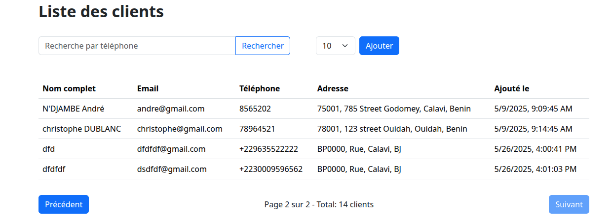
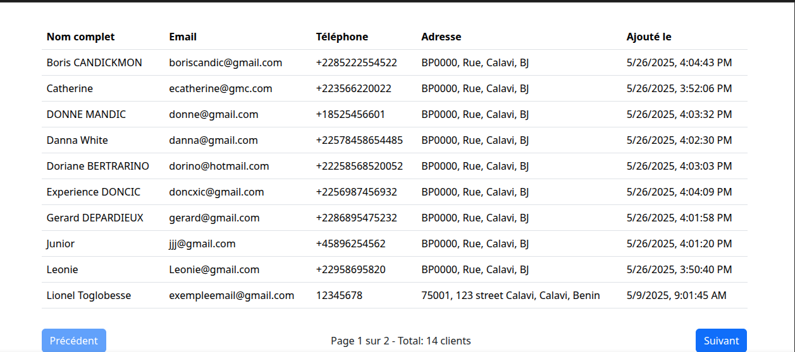

# Gestion des Clients – Projet React + Firebase
#Nouveau Test
Ce projet est une application web de gestion de clients, développée avec **React** et **Firebase**.  
Après avoir forké le projet d'origine, plusieurs améliorations et nouvelles fonctionnalités ont été apportées :

## Fonctionnalités principales

- **Authentification sécurisée** des utilisateurs via Firebase Auth.
- **Affichage de la liste des clients** avec tri alphabétique par nom.
- **Barre de recherche** permettant de filtrer les clients par numéro de téléphone (recherche exacte).
- **Pagination dynamique** : possibilité d’afficher 10, 50 ou 100 clients par page, avec navigation entre les pages.
- **Ajout, modification et suppression** de clients via un formulaire interactif.
- **Affichage détaillé de l’adresse** de chaque client.
- **Interface responsive** et moderne grâce à React Bootstrap.

Toutes les opérations de filtrage, tri et pagination sont effectuées côté serveur via Firestore, garantissant performance et cohérence des données.

## Prise en main

1. **Fork du projet** sur GitHub.
2. **Configuration de Firebase** via le fichier `.env` (voir la documentation du projet pour les variables nécessaires).
3. **Installation des dépendances** (`npm install`).
4. **Lancement du projet** en local (`npm run dev`).

## Démo

Voici quelques illustrations du fonctionnement de la pagination et de la recherche dans l’application :

### Captures d’écran

| Page 1 | Page 2 |
|--------|--------|
|  |  |

### Vidéo de démonstration

[▶️ Voir la vidéo de démonstration](./Demo/demo_video.mp4)

